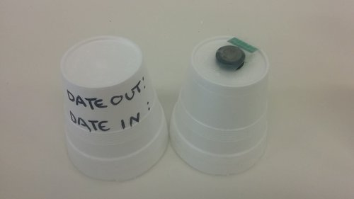
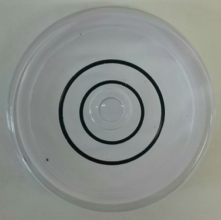
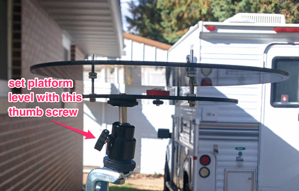
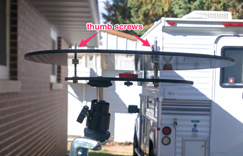
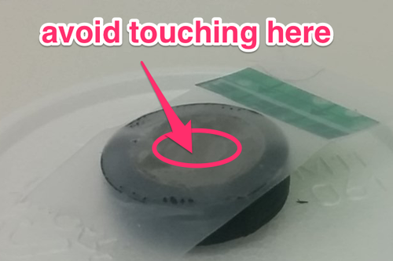
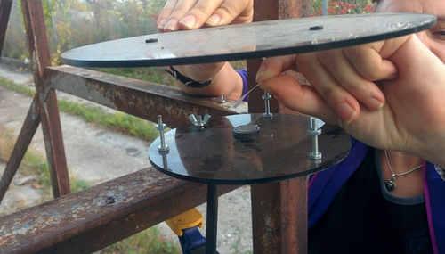

##Deploying Passive PM Monitors

https://publiclab.org/notes/mathew/10-26-2015/deploying-passive-particle-monitors

https://publiclab.org/notes/mathew/12-22-2015/passive-particle-monitor-deployments-feedback

_Materials needed_

* [Prepared](../preparation) [Passive PM Monitors](../monitor)
* [Monitor Housing](../housing)
* Tape tabs for covering the monitors (Arrow Flags, 3M)
* Two-axis Bubble Level
* [Deployment Worksheet](deployment.md)

Prepared passive PM monitors are packed in a stack of styrofoam cups, each one covered with a cup.  Each covering cup has a place to write the date and time of deployment. Inside each cup pair is a sampler covered with a tape tab to prevent dust from entering the clean stub in transit.

In order to analyze the results of a passive PM monitor deployment, each sample requires additional information, which should be recorded on separate Deployment Worksheet.

##Pick a Location for the housing

Ideally, monitors will be placed 180cm (71") above the ground, and a distance from obstacles greater than the height of those obstacles. Such an ideal deployment is not always possible. Describe and record the location and descriptions of obstacles in the Deployment Worksheet.  If possible, take photos of the deployment site. 

##One Week Deployment

Pick a day and time to deploy the passive PM monitor that you will also be available for in seven days to recover the monitor.  Record the date and time on the Deployment Worksheet.

1.
Clamp the passive PM monitor housing to a pole or other solid object.

2.
 Set the housing level using a bubble level, tightening the ball head's thumb screw.

 
 

3.
Remove sampler stub from box, leaving the tape tab cover on. write down the date and time it was removed on the cover cup.

4.
Unscrew the thumb screws holding the housing's lid on. watch for the rubber washers underneath, they're tiny and easy to lose (we provided some extras - you can use a dish as a catcher).

5.
Holding the sampler stub by its sides and supporting the housing with your other hand, press the sampler into the rubber grommet in the center of the housing. Try to avoid touching the top of the monitor, as in the center of the top there is a 1/4" area of fragile mesh that is easy to deform.

6.
Remove the sticky tab protecting the passive PM monitor and screw the housing's lid back on. The housing lid has a small groove on its underside that catches raindrops, make sure this groove is facing down.

7.
Use the bubble level to check if the housing is level. Reset the level of the housing using the thumb screw on the ball head if necessary.

8.
Leave in place for seven days, and record daily weather information on the Deployment Worksheet. 

##Recovery

9.
Check the housing to see that it is still level.  Note any change in the Deployment Worksheet.

10.
Unscrew the housing lid and place a sticky tab over the sampler stub. Replace with a new sampler stub.

11.
Place the exposed sampler stub back in its box and write down the date and time it is returned on its cover cup.

12.
write the time of return on the Deployment Worksheet.

13.
Prepare samples for [microscopy](../microscopy) or package and ship to whomever is conducting the microscopy.
