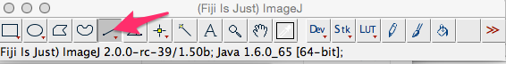
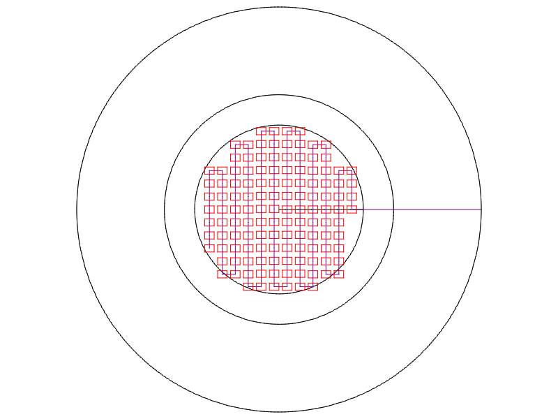

#PM Microscopy
The goal of PM microscopy is to use a visible light microscope and digital camera to capture and measure deposited particles so that their size, shape, and frequency can be [analyzed](../analysis). to extrapolate airborne PM during the sample period. 

The current microscopy hardware and software in use falls short in the face of several imaging issues and could use help. 

##Goals and Confounding Factors

The primary goal is to image and measure as much as possible of surface of the [passive PM monitor's](../monitor) deposition substrate- a glass slide cover- without taking repeat measurements. The greater the area imaged, the more accurate the [analysis](../analysis) gets.  250-300 particles are needed for "analytical certainty," and in the literature, imaging itself contributed 5% to the overall error.  (166, Ott et al. 2008)

The factors to be measured are:

* scale of microscope images in pixels/μm2
* area of each particle
 
* perimeter of each particle

From these measurements, additional factors are derived:

* total area imaged
* circularity of each particle (4π x Area/Perimeter2)

A microscopy protocol must account for false positives, mis-measurements and other issues arising from the qualities of the particles measured:

* refraction of light by particles
* varying albedo and opacity across each individual particle
* varying albedo and opacity of different types of particles

A microscopy protocol must also account for issues arising from imperfections in the microscope, related equipment, and imagine process including:

* dust and artifacts in the microscope's optics
* dust outside the focal plane
* pixel noise from the image sensor
* variable lighting within each image
* variable lighting between images
* variable lighting and exposure between image/sample sets
* duplicate images of the same particle

Solutions to these issues could be conducted in software or hardware-- a flatter, better focused light source could solve imaging variability, or a flat field or pseudo-flat field correction could solve the issue. 

##Current microscopy imaging protocol

The current protocol is based on manual microscopy using an OpenFlexure microscope.  As automated motor control for the [OpenFlexure](http://www.waterscope.org/3d-printing/) microscope advances, imaging will be [automated](https://github.com/fr293/motor_board).

####Materials
* deployed passive PM monitor
* standardized spheres 
 * Literature: 5μm borosilicate glass microspheres (was Duke Scientific 9005, now [Fisher Scientific 9005](https://www.thermofisher.com/order/catalog/product/CD9005)).
 * Currently using: PSL micropheres 2.07μm ([Ladd Research 40787](http://www.laddresearch.com/polystyrene-latex-spheres))
* stage micrometer ([Meiji Techno 285](http://meijitechno.com/ma285-1mm-divided-into-100-units))
* microscope with digital camera
 * Currently using an [OpenFlexure microscope LS65]((http://www.waterscope.org/3d-printing/))
 * 40x RML Objective, conjugate distance 160mm, DIN 45mm ([Nanjing City Srate](https://www.aliexpress.com/store/product/40X-0-65-DIN45mm-Achromatic-Objective-Lens-for-Biological-Microscope-195mm-Universal-Objectives/101130_32788001931.html?spm=2114.12010608.0.0.NzCL5s))

* Computer with [ImageJ](http://fiji.sc) and a particle measurement script from this repository

__Installing scripts in ImageJ__

##Microscope Calibration

Two different calibration targets are used for coarse and fine calibration of the microscope:: a stage micrometer and standardized spheres. Before calibration, adjustments will be made to the microscope and camera to achieve flat illumination across the image.

####achieving flat illumination
this is a stub. 

####Setting a rough calibration with a stage micrometer

Take an image with a stage micrometer.

![stage micrometer image]

Bring the image into ImageJ and use the line tool to draw a line between two points of the stage micrometer.

![line drawn on stage micrometer in ImageJ]

Now go to the menu _Analyze > Set Scale_.

* Set unit length to μm
* check "global" (this will make it apply to all the other images opened)
* record the number of pixels/ μm

####Refining calibration with standardized spheres
We will now compare the stage micrometer calibration against standardized spheres in order to refine the pixels/μm calibration. The goal is to replicably measure the spheres within +/-5% of their known size.

Prep cover slip and slide according to [preparation guidelines](../preparation).

Use a permanent parker to add a focusing dot to the cover slip. 

![image])

Apply standardized spheres to the cover slip.

![image]

Take an image with the microscope with no sample in place.  This will be used for flatfield correction, and to account for dust in the optics. 

[Process image]
[Example image]

Place image with standardized spheres on the microscope.  Focus on the focusing dot, and take 3 to 5 images of the spheres.

Bring these images into ImageJ and apply the particle measurement script. 

[example image]

Save the CSV file produced by ImageJ and use a spreadsheet program to take an average particle measurement of the analyzed particles.

Repeat for each of the images taken.  Use the deviation from the spheres' known measurements to adjust the pixel/μm ratio in _Analyze > Set Scale_. 

Repeat the particle measurement to determine if particle measurements are within the appropriate range of +/-5%.

##Current Microscopy Imaging process

Samples can be scanned manually with the OpenFlexure microscope using the [Scan Pattern](scan_pattern.md). The scan pattern is drawn to-scale in scanplan4.dxf. It moves right to left,  taking 129 images covering 21% of the deposition surface area. 

##Microscopy Measurement process

The steps below are implemented in a batch processing script in this repository folder. Load that script

INSTRUCTIONS

####Thresholding the image
Thresholding makes everything on one side of a color or lightness threshold a single color.  We are going to do it on a greyscale image to get a black and white image that is "binary," i.e. every pixel is either black or white.

First, convert the image to greyscale by going to _Image > Type > 8 bit_

Now we want to threshold the image to a binary image.  Go to _Image > Adjust > Threshold_

There are a variety of available modes, all of them seem to produce a decent binary image if the brightness is adjusted correctly.  It is an open question as to which we should use.

select a threshold that isolates particles without including noise.  This should be the same threshold used universally during processing, so some testing is called for. 

Now to make sure there aren't any greyscale elements left by using the command _Process > Binary > Make Binary_

You should have something like this:

####Filling "Holes"

While thresholding gave us a good high-contrast image, somewhat transparent or reflective particles have "holes" inside them (left) that we want to fill (right):

Go to _Process > Binary > Fill Holes_

####Measurement
Now our image is ready to analyze.  We first need to set the measurements that will be taken. Go to _Analyze > Set Measurements_ and check off:

* Area
* Perimeter
* Shape Descriptors
