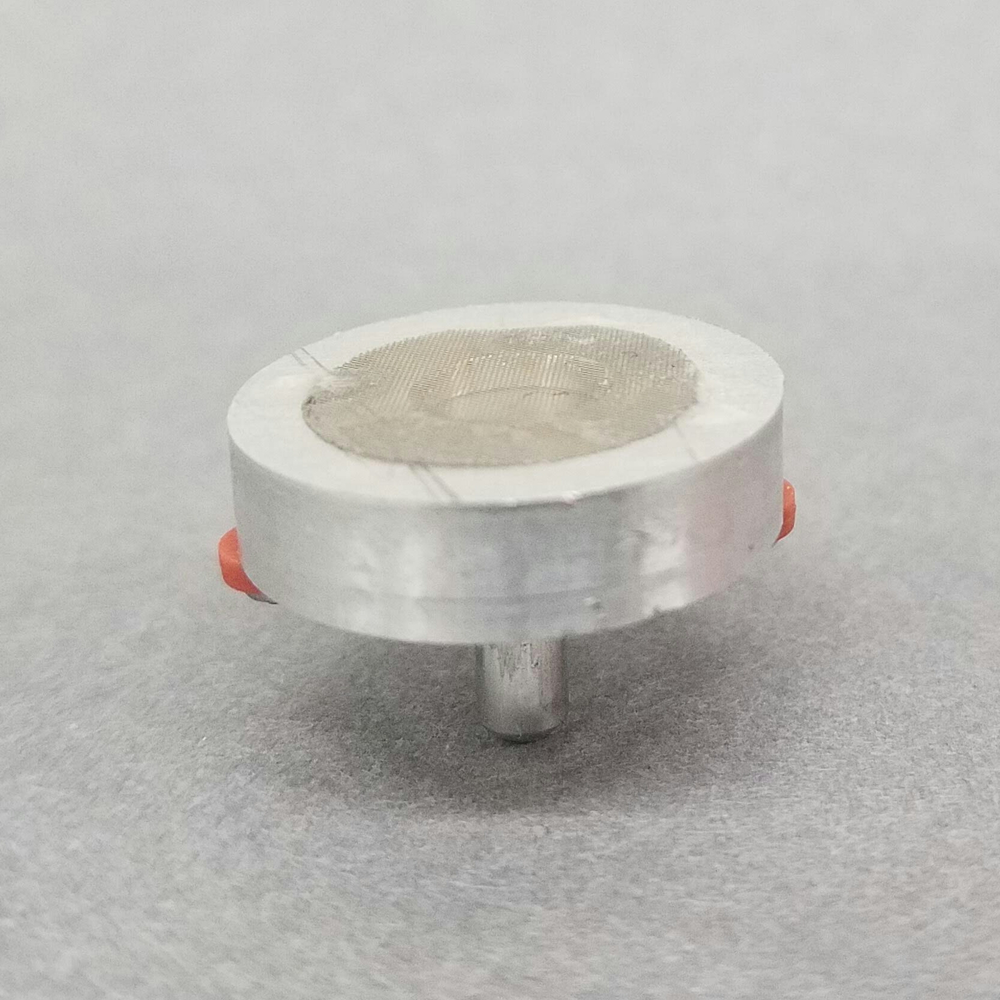
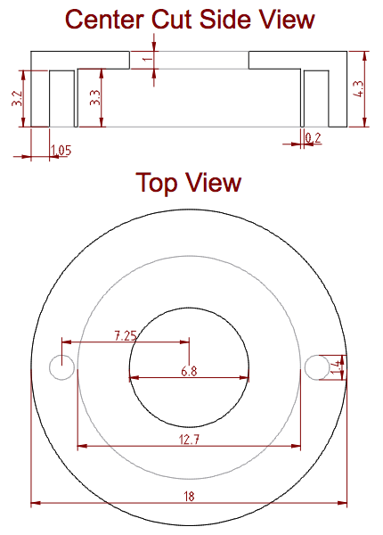
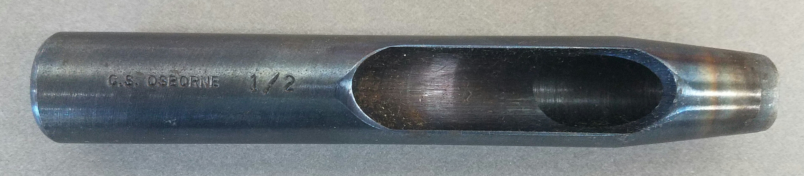
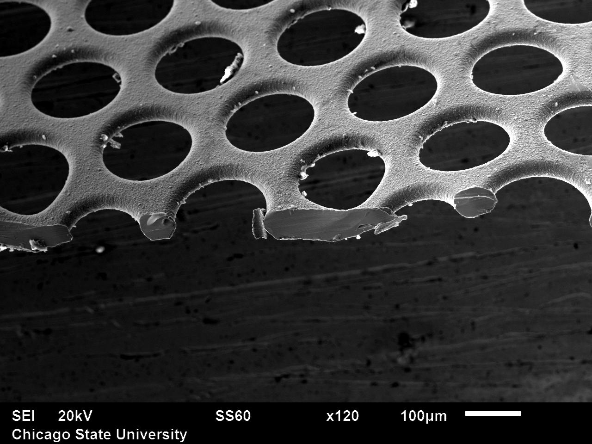

##U. Iowa-modified UNC Passive Monitor

The UNC Passive Monitor was originally developed for indoor PM monitoring and analysis with a Scanning Electron Microscope (SEM).  This device was modified by the University of Iowa to use visual light microscopy, as described in [Ott & Peters 2008](../bibliography.md).  A [housing](../housing) for the passive PM monitor was also developed to enable outdoor use.

Read more about identifying these parts in [this note on Publiclab.org.](https://publiclab.org/notes/mathew/09-02-2015/replicating-a-passive-dust-monitor-method)

###components:

#####SEM stub
A standard SEM pin stub 12.7mm in diameter with an 8mm pin. [Ted Pella Part #16111](http://www.tedpella.com/SEM_html/SEMpinmount.htm)

#####Slide cover
12mm dia .015-.17mm thick circular cover glass for slides. [Fisher Scientific part #12-545-80](https://www.fishersci.com/shop/products/fisherbrand-cover-glasses-circles-11/1254580)

#####Screws
two  1/8” 0-80 stainless steel screws hold the SEM stub in place with size 002 square-profile silicone O-rings (3/64"ID, 9/64"OD). McMaster-Carr parts [#91772A052](https://www.mcmaster.com/#standard-rounded-head-screws/=15s9ecf) and [#1182N002](https://www.mcmaster.com/#o-rings/=15s9eqh)

#####Cap
The cap is specified to have the following dimensions:

The original caps were milled from stainless steel, and a conductive material that does not build static charges is preferred. The caps in the project are made from 6061 aluminum, which as a soft metal is much easier to machine. 

Production files:
2D: [cap-diagram.dxf](cap-diagram.dxf), 3D:

#####Adhesive
Adhesive holds the mesh onto the cap. The original adhesive is unknown.

Currently cyanoacrylate (superglue) is used because it is easily dissolved in acetone and non-damaging to the mesh and cap.

#####mesh

1/2" (12.52mm) diameter 127μm thick nickel mesh is atop the cap.

The literature describes mesh sourced from Buckbee-Mears Inc. of St. Paul, having holes of conical cross section and dimensions of 160μm (top diameter) and 225μm (bottom diameter), a thickness of 127μm, a hole spacing of 280μm center-to-center, and 27% open area.

The current mesh in use is Precision EForming #75HH-160 electroformed nickel mesh, which does not conform to these dimensions (see below).

The mesh is best cut with a punch. A 1/2" punch such as this Osborne No. 245 belt punch ([item #51496](http://www.csosborneleathertools.com/product_detail.php?p_id=378)) and a wood or plastic mallet are preferred.

Buckbee-Mears was absorbed into Precision Eforming of Cortland, NY, who, while claiming to produce a similar product, do not.  Precision EForming mesh #75HH-160 has symmetrical holes 160μm in diameter at their narrowest, approximately 200μm in diameter in the top and bottom of the hole, and with an open area of approximately 52%.

The Precision Eforming product is outside the preferred specification defined in Figures 1 & 2 of patent 6321608:

* hole diameter: 75μm to 610μm.
* thickness: 50μm to 200μm
* open area: 20-38%

>Manufacture, use, or sale of this device is protected by U.S. patent 6,321,608, owned by The University of North Carolina at Chapel Hill. Any party desiring a license to use the aforementioned patent for commercial purposes shall contact the Office of Commercialization & Economic Development at UNC at 919-966-3929.
