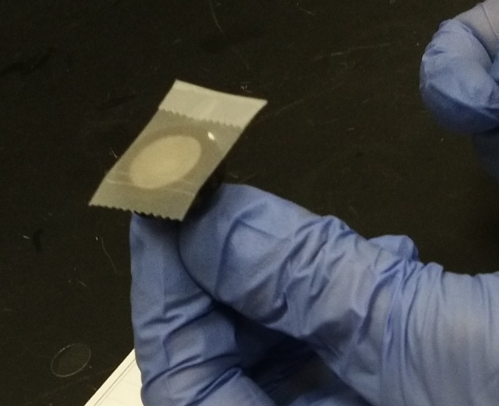
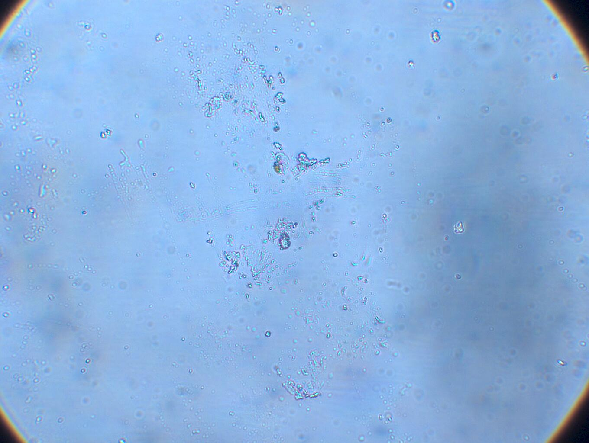
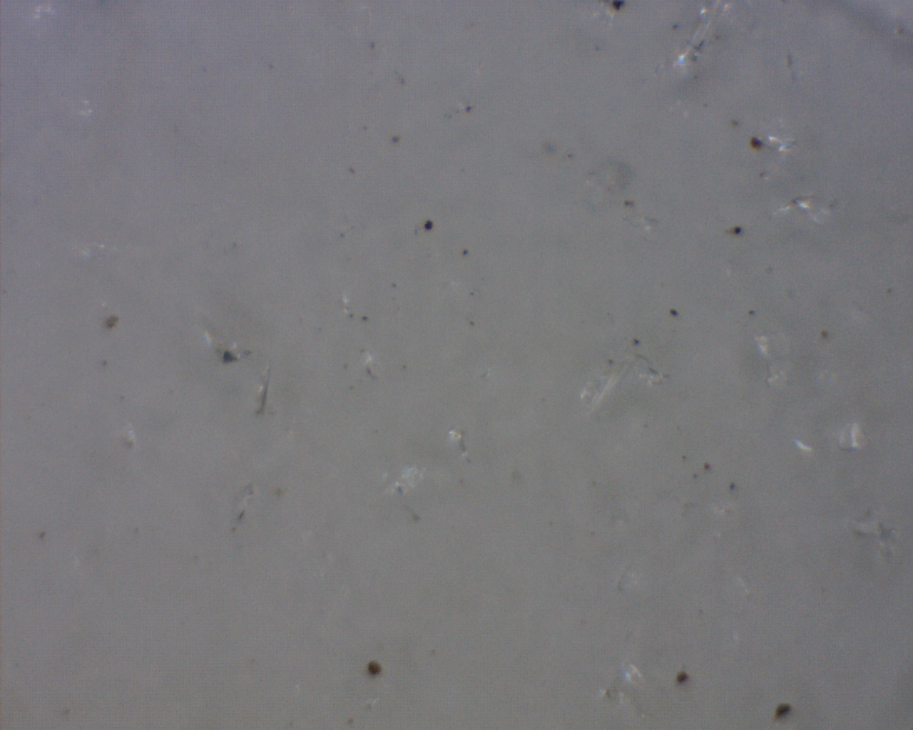
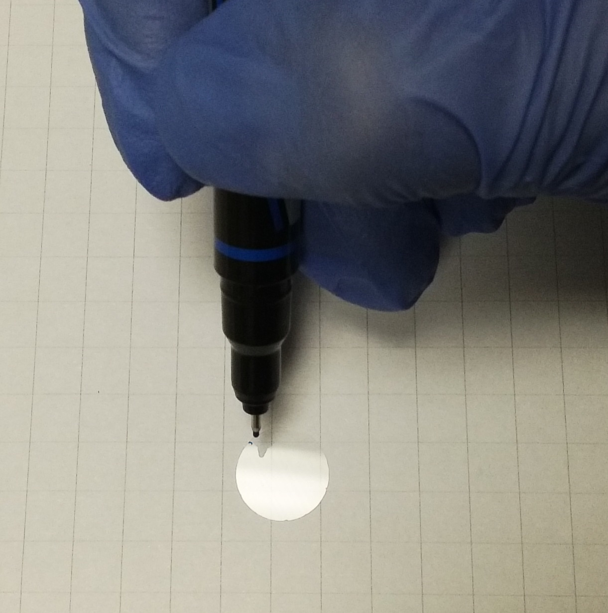
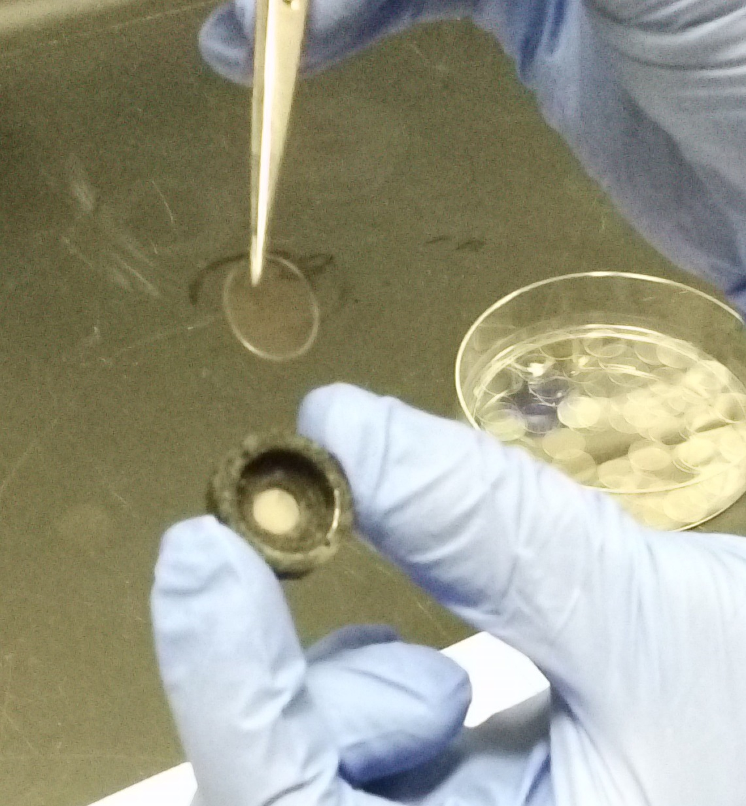
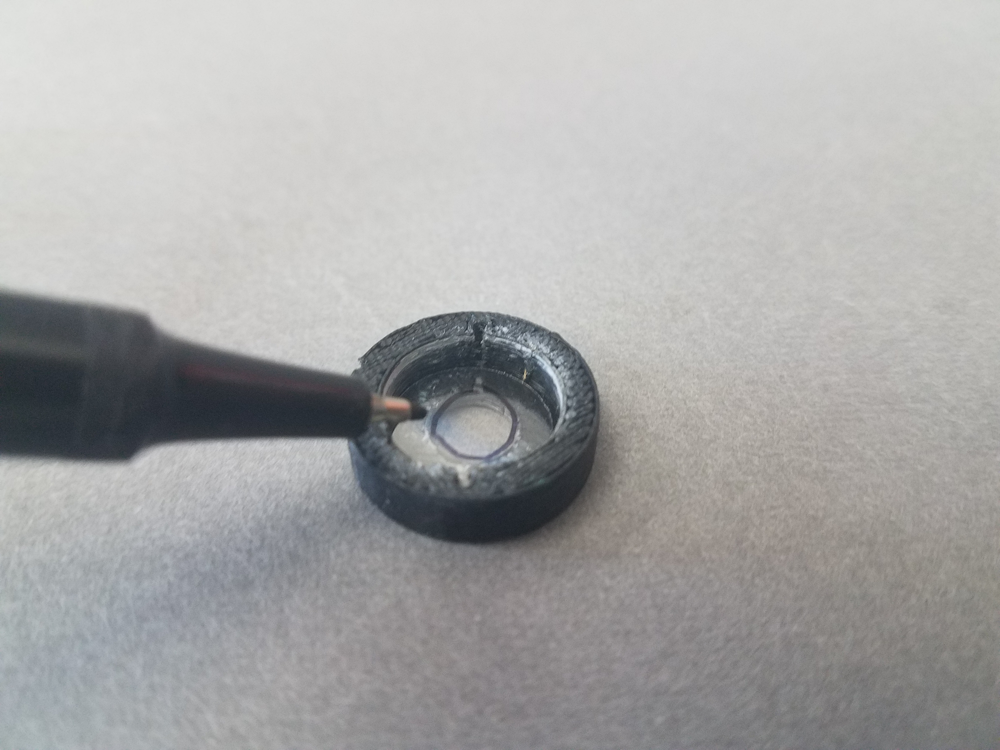
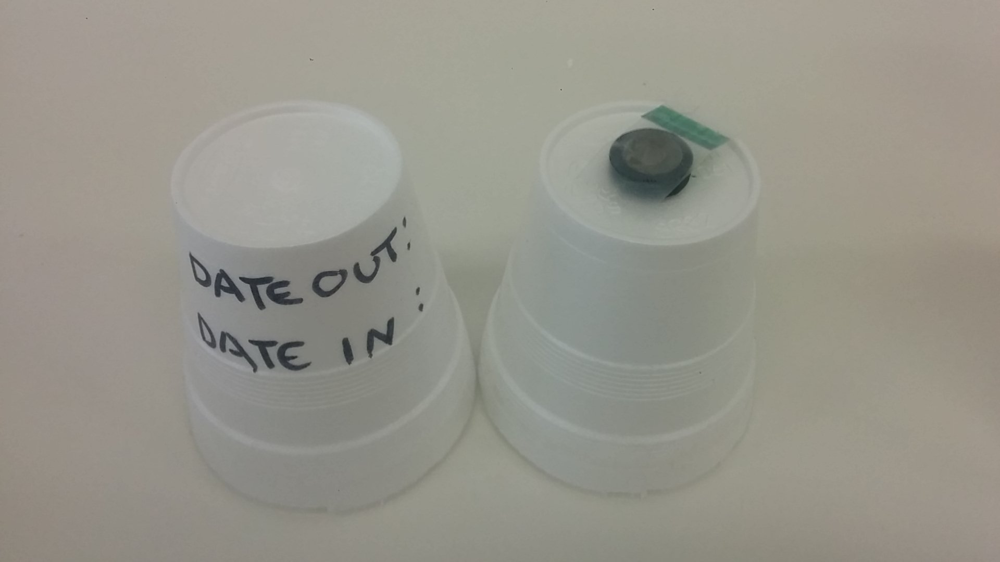

##Passive PM Monitor Preparation

Preparing [passive PM monitors](../Monitor) for [deployment](../deployment) requires inspecting, cleaning, covering, and packaging the monitors.

####Materials Needed
* [Passive PM Monitor](../Monitor)
* Powder-free disposable gloves (nitrile or similar)
* compressed air or 
* anti-static laboratory wipes such as KimWipes (#34155, Kimberly Clark)
* Anti-static strip (Staticmaster Polonium-210 Ionizer #1U200, Amstat Industries)
* Tape tabs for covering the monitors (Arrow Flags, 3M)
* polystyrene foam cups or SEM stub holder (Ted Pella 16709).
* fine-point permanent marker (Sharpie)

1. 
The mesh cap and SEM mount should be inspected for dust and grime and cleaned with compressed air*. 

>use real compressed air only, or an electric electronics duster. Aerosol can electronics dusters leave residue: 

2.
Clean the cover slip with a folded-over lab wipe, and inspect under a microscope to make sure it is free from shards of glass (pictured below) and generally clean. 

Coverslips may be cleaned with alcohol if necessary, and then cleaned with a lab wipe.

3.
Hold the cover slip within 1cm of the Anti-static strip to neutralize static charge.

4.
Use a permanent marker to mark a focusing dot on the edge of the cover slip.

5.
Place cover slip into the monitor's mesh cap, with the focusing dot facing the mesh.

6.
Use a permanent marker to draw a circle around the sampling area. 

 
7.
Place the SEM stub into the cap and tighten in place with screws. 

8.
Place a tape tab over the mesh cover and push the stub of the monitor into the top of a polystyrene foam cup. (or alternatively, into an SEM stub holder)  Mark a covering cup or the holder with spaces indicating the time and location of sampling.

9.
[Deploy.](../deployment)